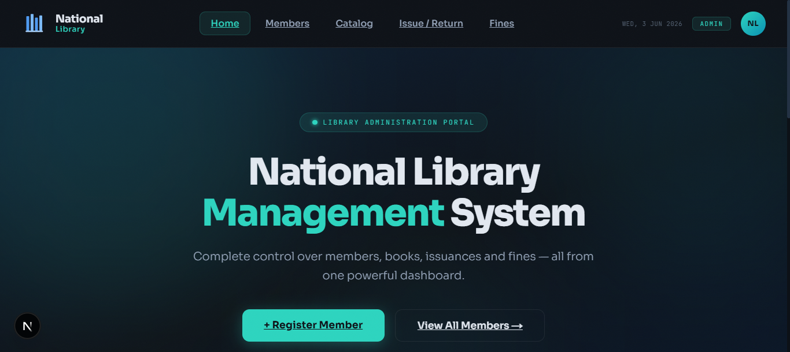
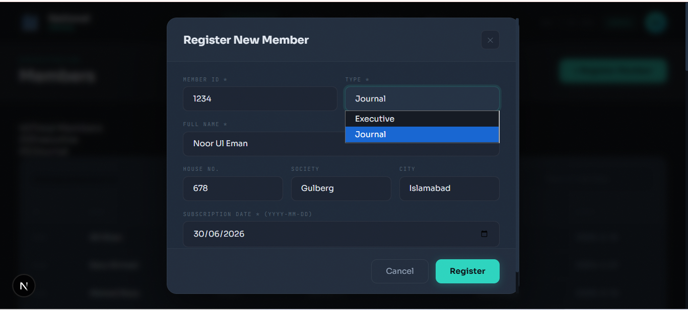
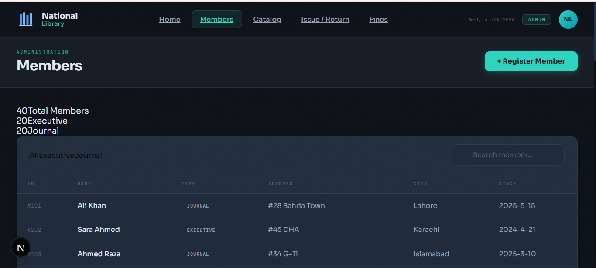
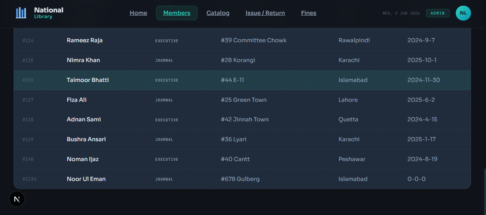
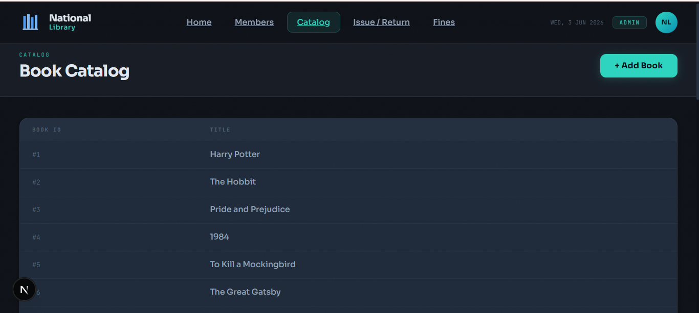
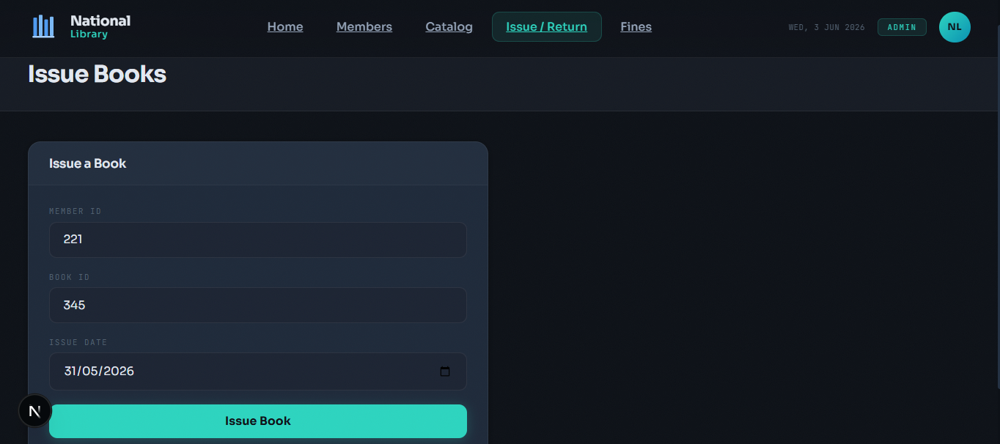
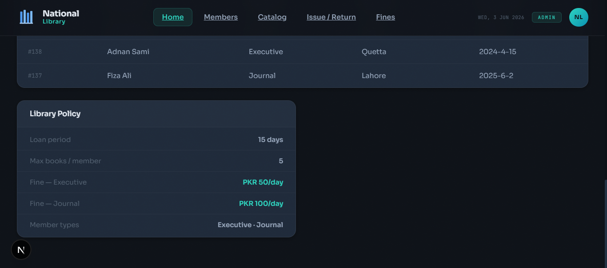
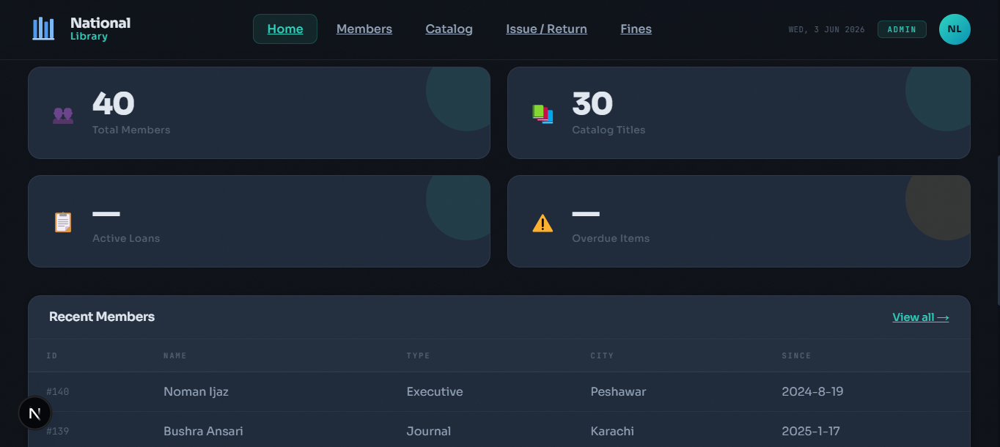

# 📚 National Library Management System

A full-featured Library Management System with a C++ backend and a modern dark-themed HTML/CSS/JS frontend. Built to manage books, members, issue/return records, and fines efficiently.

---

## 🚀 Features

- 🏠 **Dashboard** — Overview of library stats and quick access to all modules
- 👥 **Member Management** — Add, view, and manage library members
- 📚 **Book Catalog** — Browse and manage available books
- 📖 **Issue & Return** — Issue books to members and track returns
- 📊 **Summary & Reports** — View library activity and issue history
- 💰 **Fine Tracking** — Monitor and manage overdue fines

---

## 🛠️ Tech Stack

- **Backend:** C++
- **Frontend:** HTML, CSS, JavaScript
- **UI Theme:** Dark mode with teal accent colors

---

## 📸 Screenshots

### 🏠 Homepage
<p align="center">
  
</p>

### 👥 Member Management
<p align="center">
  
  
  
</p>

### 📚 Book Management
<p align="center">
  
</p>

### 📖 Issue & Return
<p align="center">
  
  
</p>

### 📊 Summary & Reports
<p align="center">
  
</p>

---

## ⚙️ How to Run

1. Clone the repository:
```bash
   git clone https://github.com/nooruleman2006/National-Library.git
```
2. Open `index.html` in your browser for the frontend
3. Compile and run the C++ backend:
```bash
   g++ code.cpp -o output
   ./output
```

---

## 👩‍💻 Developer

**Noor Ul Eman** — Software Engineer

